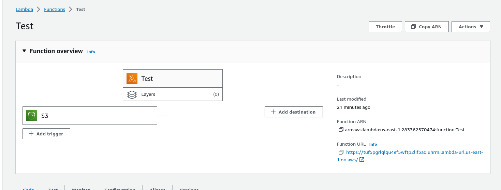
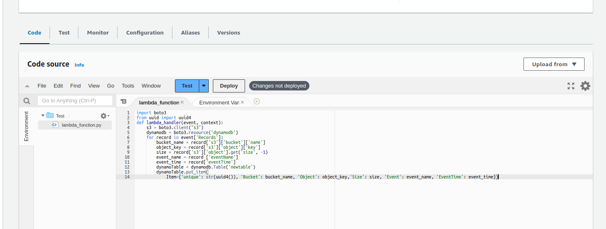
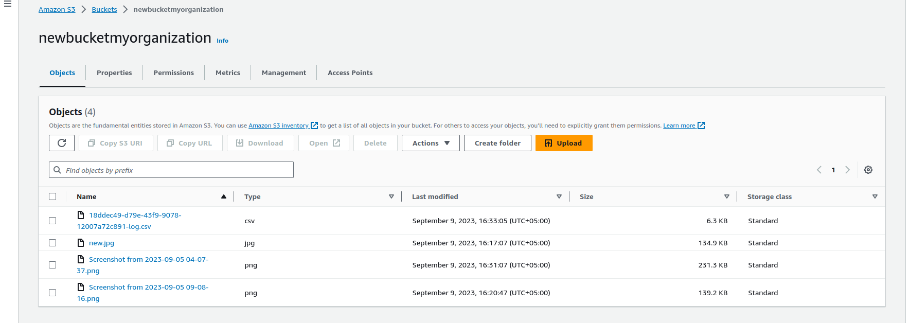
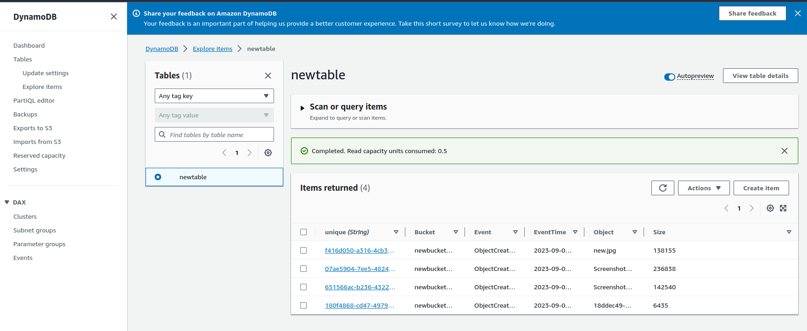

I've deployed files in S3 buckets and make the entries directly into tabel of DYNAMODB using lamba function. The function is triggered once the file is uploaded to S3 bucket. Timeout is set to lowest for cost optimization that is 3 seconds. 

